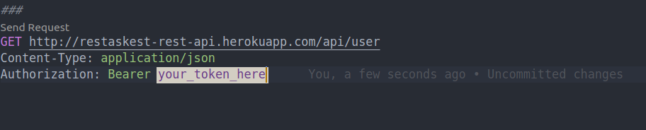
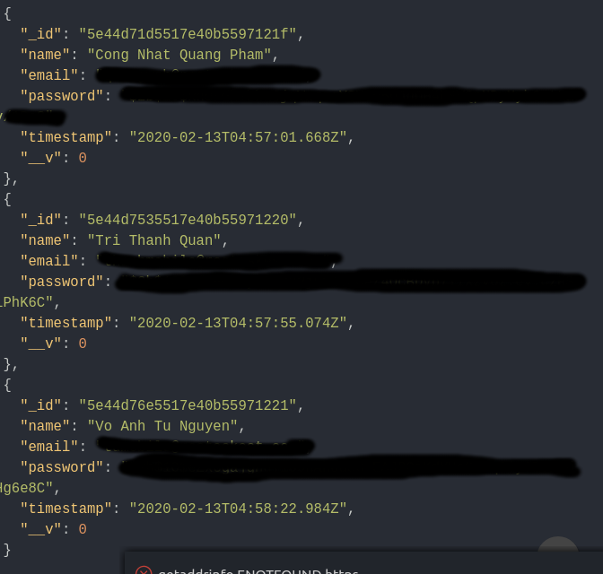

# REST api with MongoDB, Node, and Express

## Documentation

### 1. How to use the token for the REST API
#### Use curl or any supporting pieces of software (insomnia, postman) or extension (REST Client on VS Code)

#### Request example

#### Output

### 2. API Endpoint
#### API URL: http://restaskest-api.herokuapp.com/api
Endpoint | Method | Purpose | Accessibility
--- | --- | --- | ---
/schema_name | GET | List all | Private
/schema_name | POST | Add | Private
/schema_name/:id | GET | Find with ID | Private
/schema_name/:id | PUT | Update | Private
/schema_name/:id | DELETE | Delete | Private

### 3. API Authentication Endpoint
#### API URL: http://restaskest-api.herokuapp.com/
#### Notes: Employees cannot signup by themselves, they can only be added by their manager/owner
Endpoint | Method | Purpose | Accessibility
--- | --- | --- | ---
/register | POST | Add new manager/owner | Public
/login | POST | Admin login | Public
/login/manager | POST | Manager Login | Public
/login/employee | POST | Employee Login | Public

### 4. Available Schemas
ID | Schema Name
--- | ---
1 | employee
2 | inventory
3 | item
4 | manager
5 | material
6 | order
7 | payment
8 | restaurant
9 | schedule
10 | station
11 | user

### 4. Authentication Routes
#### Link to access: http://restaskest-api.herokuapp.com/
Endpoint | Method | Purpose
--- | --- | ---
/register | POST | Add a new user (JSON format {name, email, password} )
/login | POST | Get a new token (JSON format {email, password})

